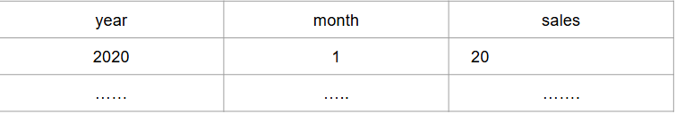
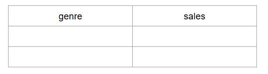
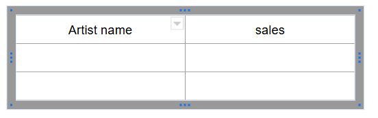

# Chinook queries 09-04-26
## distibution of sales by years and months 
- Result table should look like 
 
- Table should be ordered by year and month in the descending order
- For extracting year, month from invoice date, apply function extract, like **extract(month from invoice_date)**
## distribution of sales by genres
- Result table should look like 
 
- Table should be ordered by sales in the descending order
## distribution of sales by artists
- Result table should look like
 
- Table should be ordered by sales in the descending order

